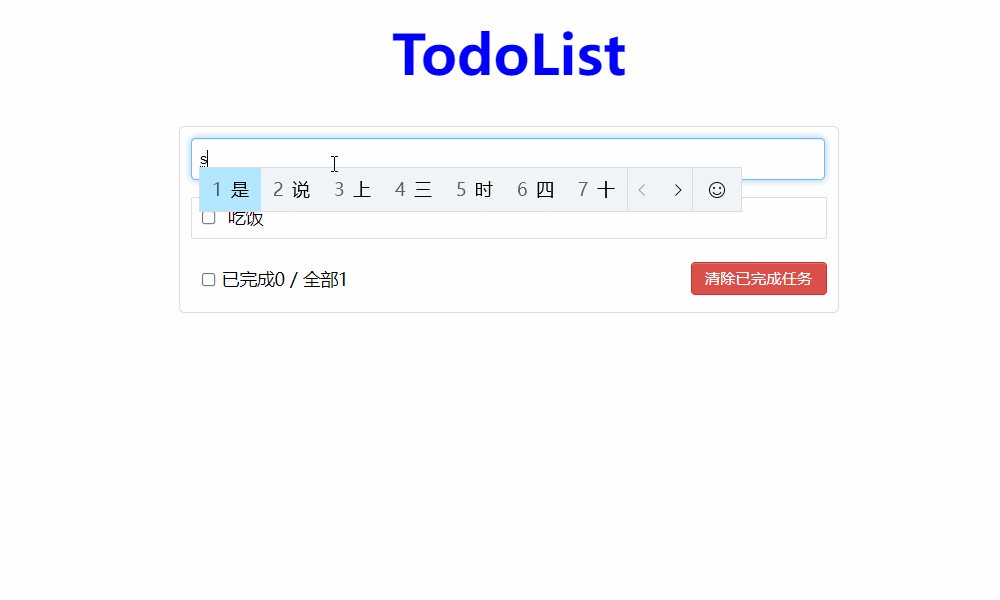

<div align="center">

<p align="center">

</p>

A simple practice for vue.

[Live Demo](https://imp2002.github.io/TodoList-Vue/)

[](https://imp2002.github.io/TodoList-Vue/)

[](https://github.com/imp2002/TodoList-Vue/blob/master/LICENSE)

</div>


## Project setup
Requires node.js
```bash
# clone the project
git clone https://github.com/imp2002/TodoList-Vue.git

# enter project directory
cd TodoList-Vue

# install dependencies
npm install

# compiles and hot-reloads for development
npm run serve
```

## Project Layout
```
.
├── babel.config.js 
├── package.json
├── package-lock.json
├── public
│   ├── favicon.ico
│   └── index.html
├── README.md
├── src
│   ├── App.vue
│   ├── assets
│   │   └── logo.png
│   ├── components
│   │   ├── AppFooter.vue
│   │   ├── AppHeader.vue
│   │   ├── AppItem.vue
│   │   └── AppList.vue
│   └── main.js
└── vue.config.js
```
